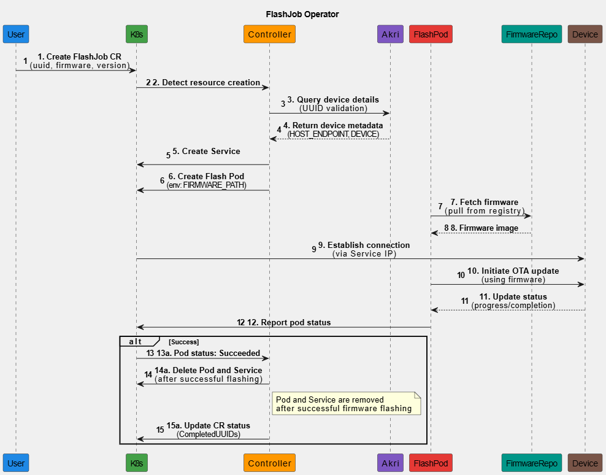

# FlashJob Operator Lifecycle

The FlashJob Operator is a key part of our Cloud-Native IoT Platform, built to automate and simplify the firmware update process for IoT devices within Kubernetes-based deployments. This guide explains how the FlashJob works.

{width="800"}

The lifecycle begins when a user creates a FlashJob Custom Resource (CR) in Kubernetes, specifying the device UUID, firmware, and version. The FlashJob Controller detects this creation and initiates a reconciliation loop to align the system with the desired state. It queries Akri to validate the device UUID and retrieve essential metadata, such as HOST_ENDPOINT and DEVICE details.

With this information, the Controller sets up a Service for external access and creates a FlashPod configured with environment variables (FIRMWARE, PATH, UUID) to handle the flashing. The FlashPod fetches the firmware from the FirmwareRepo, establishes a connection to the device via the Service IP, and initiates the OTA update.

As the update progresses, the FlashPod monitors the process and updates its status. Upon success, the Controller marks the FlashJob CR as "Succeeded," deletes the FlashPod and Service, and records the device UUID in the CompletedUUIDs list. This structured flow ensures efficient firmware management across IoT devices in a cloud-native environment.

For the full source code, see the [FlashJob Operator GitHub repository](https://github.com/nubificus/flashjob_operator) and for more details about the flashjob component see [here](../components/flashjob.md)
