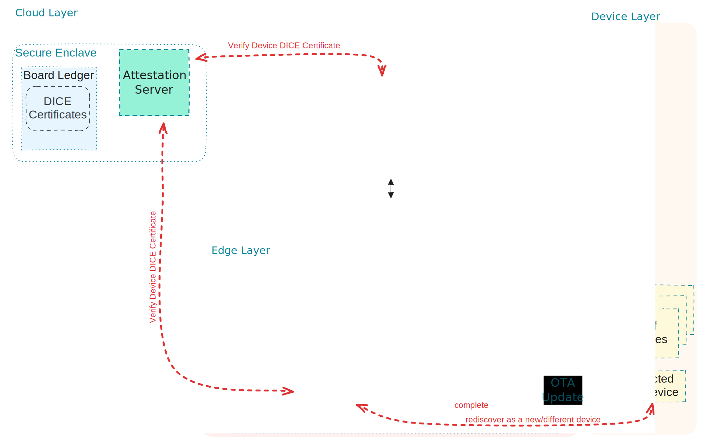

# Architecture Overview

Our Cloud-Native IoT Platform is designed to securely manage heterogeneous IoT devices and applications across edge and cloud environments. It combines trusted onboarding, modular & secure OTA updates, dynamic discovery based on [Akri](https://docs.akri.sh), and resource offloading within a Kubernetes-native control plane.

## Layers of the Architecture

- Device Layer: ESP32 and Linux-class devices capable of secure boot and attestation (via DICE).
- Edge Layer: Lightweight Kubernetes clusters or single-node runtimes (e.g., K3s, MicroK8s) managing Akri, OTA agents, and agents to provide compute off-loading capabilities to clients.
- Cloud/Orchestrator Layer: Manages policies, metadata, and orchestrates device lifecycle, offloading targets, and OTA operations.

Figure 1 presents a high-level architecture diagram of our framework.

{width="800"}

## Key Technologies

- Akri for device discovery and Kubernetes resource mapping.
- DICE Device Identifier Composition Engine) for secure onboarding.
- vAccel for portable compute offloading.
- mbedTLS for all device-to-cloud communications.
- Custom Operators/CRDs for OTA and offloading management.

## Key Components

- [Attestation Server](../components/attestation-server.md)
- [OTA Service](../components/ota-service.md)
- [OTA Agent](../components/ota-agent.md)
- [Discovery Endpoints](../components/esp32-akri.md)

For a component-level breakdown, see [Components](../components/index.md).
