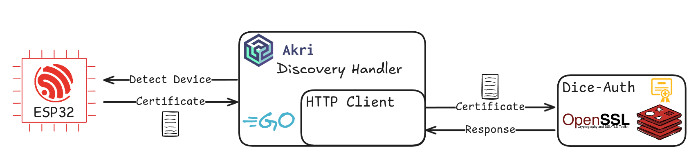
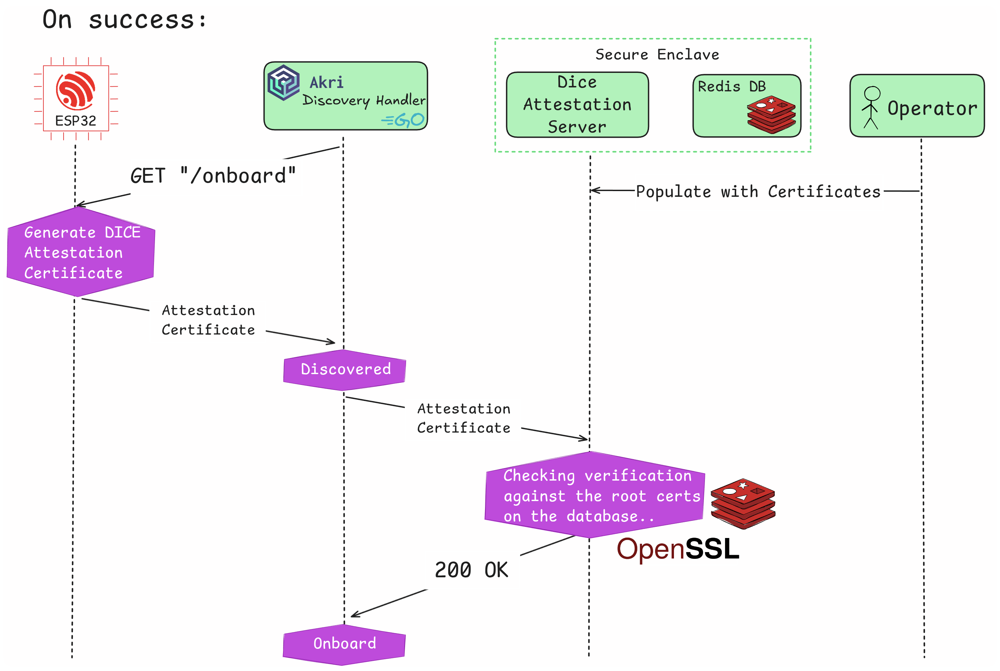

# Onboarding Workflow

## Required Components

1. [OTA Component](/components/ota-service) running on the device
2. [Akri Component](/components/esp32-akri) running on the device
3. [DICE Attestation Server](/components/attestation-server) to authenticate the device credentials
4. [Discovery Handler](/components/akri-dh/) to discover the device and onboard it after its verification by the Attestation Server

## Steps followed

1. Start the [Attestation Server](/components/attestation-server) and [submit](/tutorials/dice-auth/#submit) the UDS of the device about to update
2. The flashed ESP32 device must be equipped with the [OTA Component](/components/ota-service) and [Akri Component](/components/esp32-akri)
3. The [Discovery Handler](/components/akri-dh/) periodically sends requests on an IP address range, reaching out the devices belonging on it
4. [Device](/components/ota-service) will then be triggered on `/onboard` with a GET request to transmit its certificate
5. The Discovery Handler (after converting it from DER to PEM format) will send it to the Attestation Server
6. The Attestation Server will verify the given certificate against the available Roots stored on the Redis Database
7. The Attestation Server will respond with `200 OK` on success, or another HTTP error code on failure
8. On success, the Discovery handler will successfully onboard the device
9. On failure, the device won't be onboarded

{width="1600"}

## Authentication

Attestation is validated using the DICE chain-of-trust, based on [Google's Open-DICE](https://github.com/google/open-dice). We use DICE certificates to verify the devices of our fleet. More information about our authentication model can be found [here](/components/attestation-server/#dice).

## Onboarding devices in Akri

The Akri project uses Discovery Handlers to abstract the discovery logic from
the Agent, thus allowing developers to provide new functionality without
modifying any Akri core component. This design choice allows intervention
in the discovery process by implementing a custom [Discovery Handler](/components/akri-dh/)
that verifies any discovered devices before returning them to the Agent.

More specifically, the Discovery Handler will first verify that a
device is indeed present at a given IP and that it matches the desired application
type. Afterwards, it will request the device to send its certificate and
will forward said certificate to the Attestation Server to ensure the device
is trusted.

If this process is successful—and only then—will the device be onboarded
into the Akri installation and the Kubernetes cluster, allowing users to interact
with it via Broker pods or any other method.

{width="1600"}
