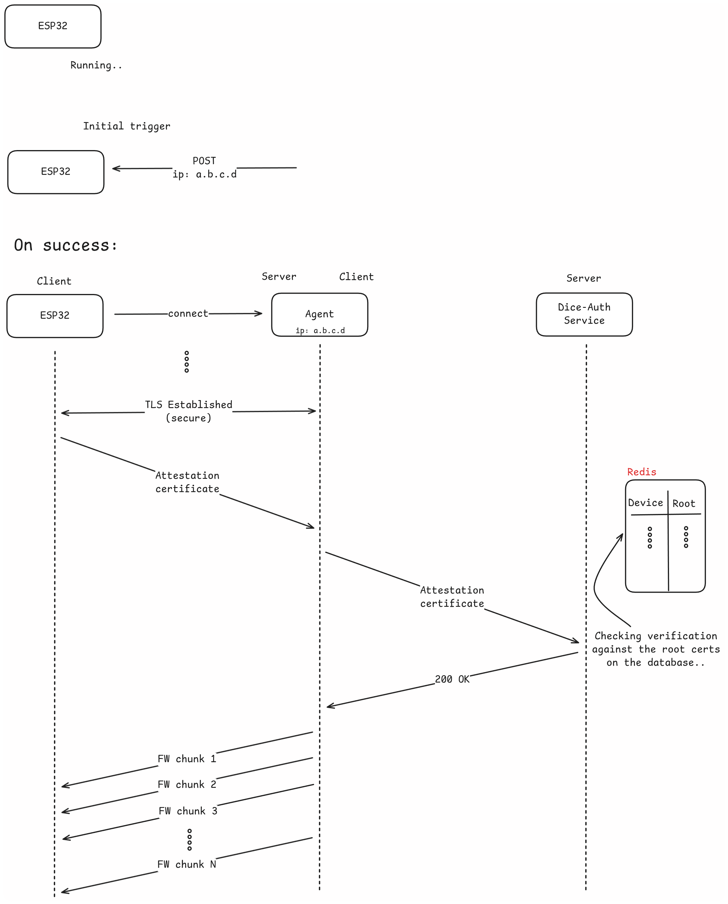
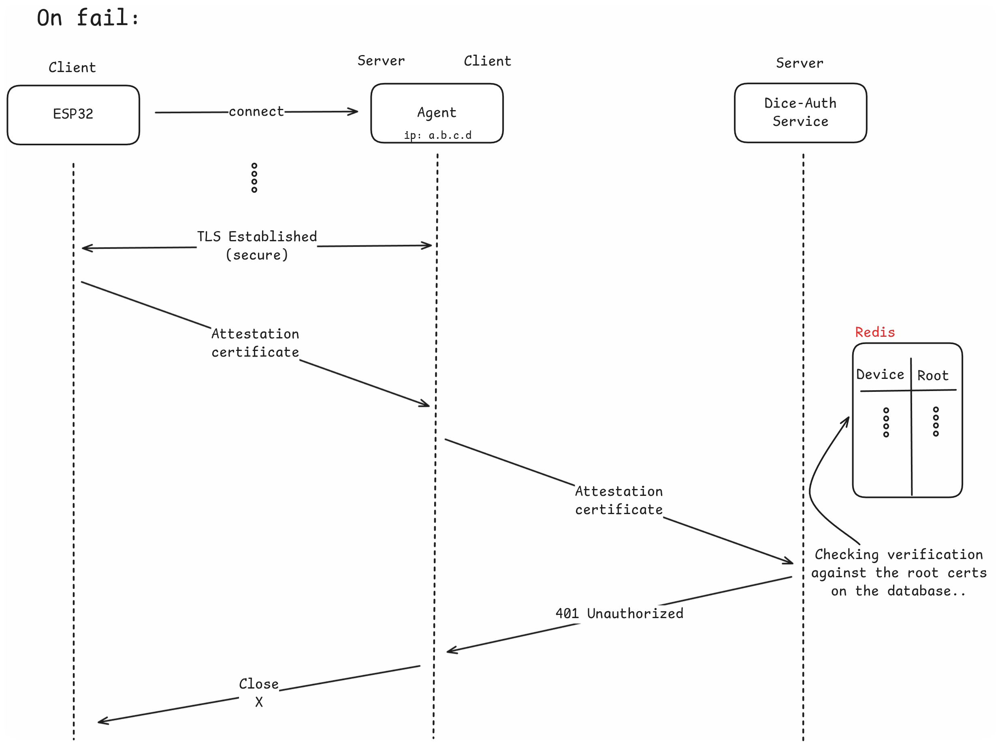

# OTA Update Workflow

## Required Components

1. [OTA Component](/components/ota-service) running on the device
2. [Akri Component](/components/esp32-akri) running on the device
3. [OTA Agent](/components/ota-agent) to communicate with the device and transmit the binary artifact
4. [DICE Attestation Server](/components/attestation-server) to authenticate the device credentials

## Steps followed

1. Start the [Attestation Server](/components/attestation-server) and [submit](/tutorials/dice-auth/#submit) the UDS of the device about to update
2. Start the [OTA Agent](/components/ota-agent), providing the new firmware, Attestation server IP address and TLS credentials. See more [here](/tutorials/ota-agent)
3. The flashed ESP32 device must be equipped with the [OTA Component](/components/ota-service) and [Akri Component](/components/esp32-akri)
4. To initialize the process send a POST request to the device, containing OTA Agent's IP address
5. [Device](/components/ota-service) (after notified) connects to the agent over TLS
6. Device transmits its attestation certificate
7. Agent connects to the Attestation Server and transmits the received attestation certificate
8. The Attestation Server will verify the given certificate against the available Roots stored on the Redis Database
9. The Attestation Server will respond with `200 OK` on success, or another HTTP error code on failure
10. On success, the agent will read the firmware from the given path and transmit it to device
11. The device verifies the signature of the received binary artifact, writes it to an available partition and reboots
12. On failure, the connection will be closed by the agent and no firmware will be transmitted.

{width="1000"}
{width="1000"}
