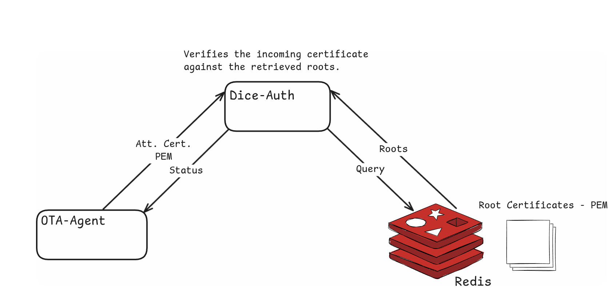

# Attestation Server

The attestation server is actually an HTTP server connected to a Redis
database. The database is used to hold all the available device root
certificates with their key (ie the MAC address). Therefore, the database could
be simply described by the following table:

| Key   | Certificate |
| ----- | ----------- |
| MAC-1 | Root Cert 1 |
| MAC-2 | Root Cert 2 |
| ..... | ......      |
| MAC-N | Root Cert N |

Thus, whenever the attestation server receives an incoming POST request with an
attestation certificate on its body, it traverses its database to check whether
there is any certificate that verifies the given one. In case of verification,
it responds with a `200 OK` HTTP code. Otherwise, the client will receive some
error HTTP code.

It's important to clarify that the Redis Database is an example solution, to avoid
any misunderstanding about security concerns. One could simply utilize another tool
to store the Root certificates of the devices.

## Dice

DICE certificates are digital certificates issued as part of the DICE
architecture, which is a chain-of-trust framework. We use DICE certificates to
verify the devices of our fleet. For each device, there is a pair of DICE
certificates: the root and the attestation certificate.

### Assumptions

- The device contains a Unique Device Secret coming from its Vendor, and can
  only be read by the bootloader. In our case, we use the MAC, which we assume
  is a UDS.
- The attestation certificate is generated by the device at early boot time
  (using the UDS), and can’t be generated anywhere else, since there’s no
  access to the UDS. In our case we generate it in application, which is not very
  safe.

### Root Certificate - Public

The root certificate of each device is coming from its vendor. This means that
every time we get a new device, we also get its root certificate, which is
unique for each board, and remains the same even if we change its firmware or
its bootloader. And that’s because the root certificate is generated using the
Unique Device Secret. More specifically, it is generated through
`generate_uds_cert()`, which receives a key as input. The key buffer comes from
a Key Derivation Function (KDF), using the MAC address and a 64 bytes salt
(common to host and device).

### Device - Attestation Certificate

It is presumably generated in the device at early boot time (assumption 2).
Except for the Unique Device Secret, the generator also uses the bootloader
hash and the application hash. The verification process involves the transfer
of the attestation certificate to the attestation server. The server has access
to the corresponding (public) root certificate and verifies the Attestation
Cert. against the Root (that is, confirm they are a pair). By following this
process, we make sure that the board is authorized to receive a new firmware
image and update. Essentially, the verification of an attestation certificate
against the root can be achieved with the following command:

```bash
openssl verify -verbose -ignore_critical -CAfile root.pem attestation.pem
```

## Workflow

1. Initialize HTTP server
2. Wait for upcoming connections
3. For each valid POST request (containing an attestation certificate on its body):
   - Retrieve the root certificates contained in the Redis Database
   - Check if any Root certificate verifies the incoming Attest. certificate
   - In case of success, respond with `200 OK`. Otherwise respond with an error code

For more information, see the [tutorial](/tutorials/dice-auth).

{width="1000"}
