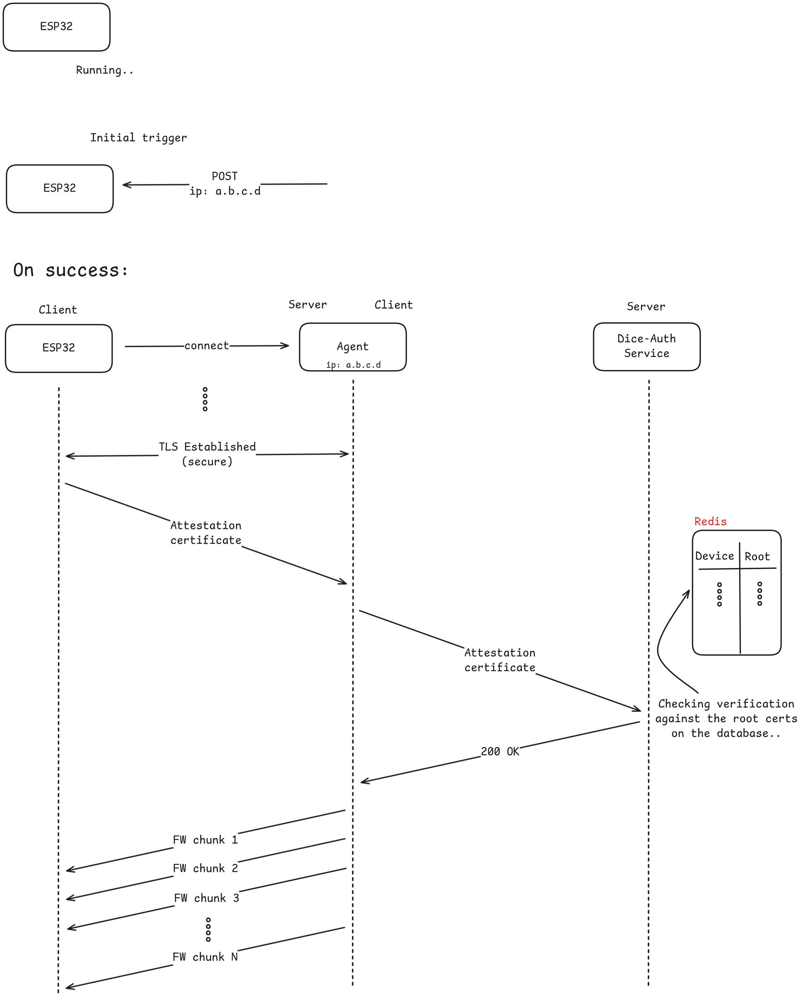
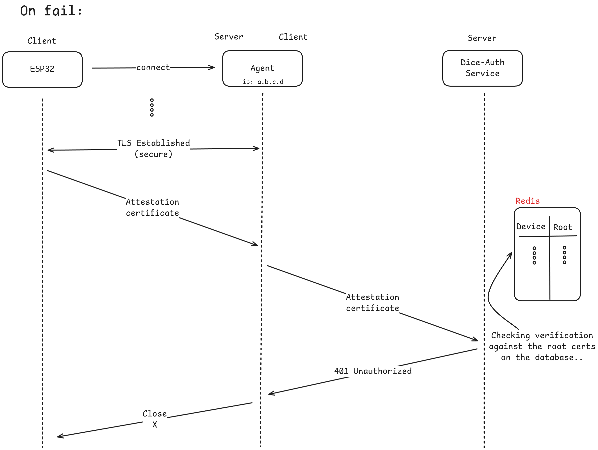

# OTA Agent

The OTA agent is resposible for communicating with the device and for authenticating it. Actually, the program operates as a TLS server (thus, the communication is secure) and waits for an upcoming connection from the microcontroller that has been requested to update its firmware. As being described in Figures 1 and 2, when it's about to update, the microcontroller will receive a POST request to its `/update` endpoint. The request will contain an IP address on its body, like `ip: A.B.C.D`. This IP belongs to the agent, which should have been executed earlier. The agent requires the following arguments to run, which are given as environment variables:



- `NEW_FIRMWARE_PATH`: The path to the firmware that will be sent to the microcontroller (on successs)
- `DICE_AUTH_URL`: The URL to connect to Dice-Auth HTTP server, to authenticate the connected microcontroller. Under the hood, the agent will send the received Attestation Certificate, while Dice-Auth will verify it against the saved Root certificates.
- `SERVER_CRT_PATH`: The certificate to be used by the TLS server. It can be generated using commands like `openssl genpkey -algorithm RSA -out key.pem` and `openssl req -new -x509 -key key.pem -out cert.pem -days 365`.
- `SERVER_KEY_PATH`: The private key to be used by the TLS server. Can be generated as shown above.

The OTA Agent runs on each device and manages update retrieval and installation in a secure and verifiable manner.



## Responsibilities

- Fetch updates from global registry
- Relay update to leaf device

## Supported Devices

- **ESP32**: Written in C, flashes new firmware via `esp32_ota_update` API.
- **Linux-class**: Deploys updated container image.

## Configuration

- `OTA_ENDPOINT`: URL of OTA Service
- `DEVICE_ID`: Unique identifier for the device
- `TLS_CERT_PATH` / `TLS_KEY_PATH`: For secure communication

## Example Flow

1. Agent contacts device to initiate the update process.
2. Device contacts Agent to establish TLS connection and provide its certificate 
3. Agent verifies device's identity and moves on to the update process
4. Agent downloads firmware blob via HTTPS.
5. Agent writes the firwware blob on a listening port of the device
6. Device checks & verifies the newly fetched firmware.
7. Device applies update and reboots.

Updates are only allowed for devices that passed DICE-based onboarding.

# Build

```bash
git clone https://github.com/nubificus/ota-agent.git --recursive
cd ota-agent
cd  mbedtls && git submodule update --init && make -j$(nproc) && cd -
make
```

