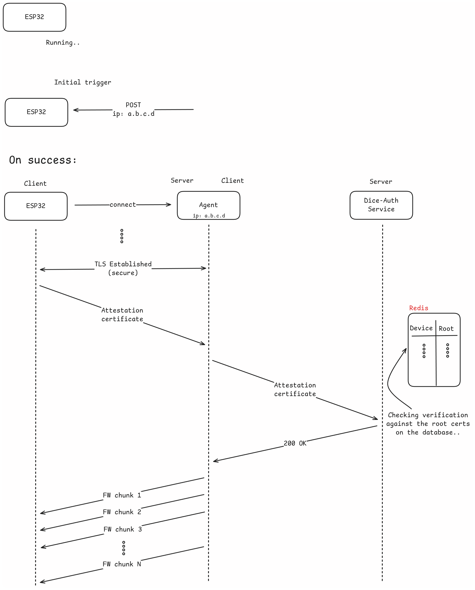

# OTA Agent

The OTA agent is responsible for communicating with the device and for
authenticating it. Actually, the program operates as a TLS server (thus, the
communication is secure) and waits for an upcoming connection from the
microcontroller that has been requested to update its firmware. As being
described in Figures 1 and 2, when it's about to update, the microcontroller
will receive a POST request to its `/update` [endpoint](/components/esp32-akri). The request will contain
an IP address on its body, like `ip: A.B.C.D`. This IP belongs to the agent,
which should have been executed earlier. The agent requires the following
arguments to run, which are given as environment variables:

- `NEW_FIRMWARE_PATH`: The path to the firmware that will be sent to the
  microcontroller (on success)
- `DICE_AUTH_URL`: The URL to connect to [Dice-Auth HTTP server](/components/attestation-server), to authenticate
  the connected microcontroller. Under the hood, the agent will send the
  received Attestation Certificate, while Dice-Auth will verify it against the
  saved Root certificates.
- `SERVER_CRT_PATH`: The certificate to be used by the TLS server.
- `SERVER_KEY_PATH`: The private key to be used by the TLS server.

The OTA Agent runs on each device and manages update retrieval and installation
in a secure and verifiable manner.

## Responsibilities

- Verify the connected device against an attestation server
- On success, transmit the firmware to leaf device
- On failure, close the connection

## Configuration

- `DICE_AUTH_URL`: URL of the attestation server
- `NEW_FIRMWARE_PATH`: Where to find the new firmware to be used in OTA update
- `SERVER_CRT_PATH` & `SERVER_KEY_PATH`: TLS certificate and private key For secure communication

## Example Flow

1. Agent starts a TLS server (`SERVER_CRT_PATH` & `SERVER_KEY_PATH`)
2. [Device](/components/ota-service) (after notified) connects to the agent
3. Device transmits its attestation certificate
4. Agent verifies device's identity against the attestation server (`DICE_AUTH_URL`).
5. On success, the agent will read the firmware from `NEW_FIRMWARE_PATH` and will send it to device
6. The device applies the update after receiving the entire firmware image and reboots
7. On failure, the connection will be closed by the agent and no firmware will be transmitted.

Updates are only allowed for devices that passed DICE-based onboarding. Finally, ota-agent is not a standalone unit in the overall system layout, but rather a component used by the [Flash-Job](/components/flashjob). However, one could use it as a standalone unit too. For building and running instructions see the [tutorial](/tutorials/ota-agent).

{width="1000"}
{width="1000"}
