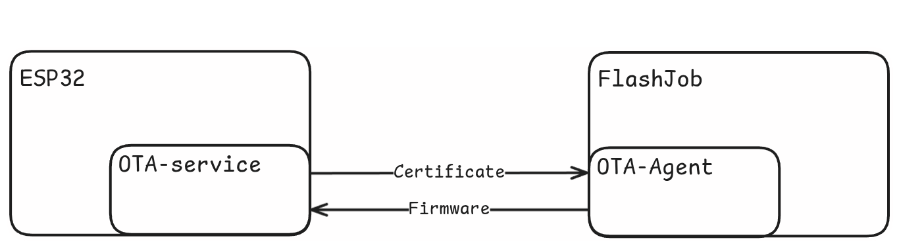

# ESP32 OTA Component

OTA Service is an ESP32 Component for performing Over the Air updates.
The component contains only the handlers. To setup the functions as akri
endpoints handlers, use the [ESP32 Akri Component](/components/esp32-akri). The component
supports secure OTA updates for the ESP32 devices when used along with
rest Cloud-Native-IoT subsystems. Actually, this component provides a
function to run when a OTA HTTP request reaches the device. In this case,
`ota-service` will first generate a device certificate (DICE) to authorize
the board during the upcoming communication. The board is also responsible
to initiate a TLS connection with the [OTA Agent](/components/ota-agent), whose IP address
was previously extracted from the HTTP POST request. In case of successful
authentication, the agent will transmit the new firmware binary artifact to
the device. Finally, after writing the firmware to the first available OTA
partition, `ota-service` will verify that the artifact is properly signed
with the right private key, and reboot.

## Responsibilities

- Prepare the board for an OTA firmware update
- Provide the handler functions to perform the OTA update
- Prove device's identity
- Receive new firmware from the [agent](/components/ota-agent)
- Verify binary artifact's integrity
- Handle errors if the OTA update is incomplete
- Update the board's firmware

## Endpoints

- Setup by [ESP32-Akri](/components/esp32-akri).

## Deployment Notes

- Packaged as an `ESP-IDF` component.

See the [tutorial](/tutorials/ota-service)

## Workflow

An example workflow is shown below:

1. Extract Agent's IP address from the POST request
2. Generate a DICE certificate to prove board's identity
3. Initiate a secure TLS connection with the Agent
4. Transmit the certificate
5. In case of successful verificate, receive the new firmware
6. Write the binary artifact on the first available partition
7. Verify new firmware is valid and signed
8. Reboot to update

{width="1000"}

## API Reference

```c
esp_err_t ota_request_handler(httpd_req_t *req);
```

This function can be passed as an
argument in [`akri_set_update_handler()`](/components/esp32-akri)
so that it (only) runs when we receive a
POST request at `/update` endpoint. The function
will perform all those steps described above.

**Parameters:**

- `req`: A pointer to the handle-object of the HTTP request. See [here](https://docs.espressif.com/projects/esp-idf/en/stable/esp32/api-reference/protocols/esp_http_server.html).

**Returns:** `ESP_OK` on success, otherwise an error code.
