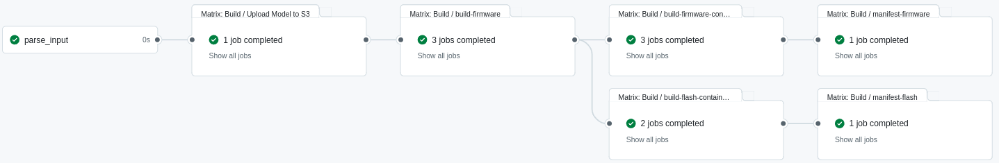

# Build Automation

## Introduction

Building and packaging firmware for embedded devices such as ESP32 can be
deceptively complex. The process typically involves managing toolchains,
setting device-specific configurations, embedding application models (like
TFLite), optionally signing binaries, and deploying the resulting firmware
across diverse hardware targets.

This section explains:

- Common industry practices for firmware building and update workflows.
- How ESP-IDF-based firmware is typically built.
- How our `esp32-build` automation system simplifies this process.

## Firmware Build Practices

Cloud providers such as AWS IoT and Azure IoT Hub offer end-to-end device management platforms. Here's how firmware build & update is commonly done with them:

### AWS IoT

- **Build**: Developers manually compile firmware using `ESP-IDF` locally or via CI.
- **Store**: The firmware is uploaded to an S3 bucket.
- **Update**: AWS IoT Device Jobs service triggers the update by instructing the device to download and apply the firmware from S3.
- **Security**: Optional code signing via AWS Signer. Root-of-trust is enforced at device boot.

### Azure IoT

- **Build**: Similarly to AWS, the firmware is compiled using local/CI toolchains.
- **Store**: The firmware is uploaded to Azure Blob Storage.
- **Update**: Azure Device Update for IoT Hub delivers the new image to registered devices via update campaigns.
- **Security**: Supported but tightly coupled with Microsoft's toolchain and portal-based setup.

### Industry VS Our CI-based Method

| Feature             | AWS / Azure IoT                        | Our Approach                                                    |
| ------------------- | -------------------------------------- | --------------------------------------------------------------- |
| Binary Distribution | Blob Storage (S3 / Azure Blob)         | OCI Image Registry (Harbor, DockerHub)                          |
| Device Targeting    | Device Shadow / Twin                   | OCI image tags + Manifest                                       |
| CI/CD Integration   | CodeBuild, Azure DevOps (manual setup) | GitHub Actions-native                                           |
| OTA Update          | Vendor-managed OTA infrastructure      | [`esp32-flashjob`](https://github.com/nubificus/esp32-flashjob) |
| Extensibility       | Vendor lock-in                         | Open, OCI-compliant, portable                                   |

## ESP-IDF Build

ESP-IDF is Espressif’s official framework for building ESP32 firmware.

A typical manual build includes:

```bash
# Set up ESP-IDF environment
. $HOME/esp/esp-idf/export.sh

# Configure your target
idf.py set-target esp32s3

# Configure project settings, PSRAM, partition table, etc.
idf.py menuconfig

# Build
idf.py build

# Flash the device (via USB)
idf.py -p /dev/ttyUSB0 flash

# Monitor serial output
idf.py -p /dev/ttyUSB0 monitor
```

Although this works well for single-target builds, it becomes cumbersome when:

- Supporting multiple hardware variants (e.g. `esp32s3`, `esp32s2`, etc.).
- Managing different RAM configurations (e.g. quad/octal PSRAM, internal RAM).
- Creating custom partition tables based not only on the app but also on the hardware target's capabilities.
- Embedding additional files (e.g. TensorFlow Lite models) into the firmware or flash partitions.
- Signing firmware for secure boot or OTA updates.

## CI-Powered Build with `esp32-build`

To solve all the above challenges, we’ve created [`esp32-build`](https://github.com/nubificus/esp32-build): a fully automated CI workflow for building and packaging firmware across many targets.

### Overview

- **Workflow:** GitHub Actions `build.yml` workflow triggered by `ci.yml` when the latter is provided with a JSON input.
- **Input:** JSON configuration file
  - **Apps**: List of applications to build, each with its own repository, branch, version, type, optional file paths to a machine-learning model and a prebuild script. It also allows defining custom variables that will be converted to environment variables.
  - **Targets**: List of hardware targets (e.g., `esp32s3`, `esp32s2`).
  - **Builder Image**: Container image containing the ESP-IDF environment.
  - **Keys**: List of signing keys (in the form of Github Secrets) for secure boot or OTA updates.
- **Output:** Per-target signed firmware, flasher images, and multi-arch manifests.

An example of the expected JSON input form is provided below:

```json
{
  "apps": [
    {
      "repo": "nubificus/fmnist-esp-ota",
      "branch": "main",
      "version": "8.8.8",
      "type": "fmnist-app",
      "model": "models/simple_cnn_tf_frozen.tflite",
      "tensor_allocation_space": "204800",
      "load_model_from_partition": "1",
      "prebuild": "scripts/prepare.sh"
    }
  ],
  "targets": ["esp32s3", "esp32s3r2"],
  "builder_image": "harbor.nbfc.io/nubificus/esp-idf:x86_64-slim",
  "keys": ["ESP32_KEY3"]
}
```

### Building Process

While the building process is quite complex and involves several steps, the most significant ones are as follows:

1. In case the user has provided a model path in the JSON input, the first step ensures that the model is included in the final container image. The model is also uploaded to our S3 storage server.

2. The project repository is fetched and the workflow checks out the specified branch.

3. Any additional app variables provided by the user are defined as environment variables.

4. If any target device has the suffixes `r2` or `r8`, the workflow will set the `quad_psram` or `oct_psram` environment variables, respectively. The user can utilize these variables in their project builder to enable the external PSRAM of their device.

5. If the user has specified a "prebuild" field that points to a preparation script within the project repository, the workflow will execute it.

6. Using the provided `"builder_image"`, which has the ESP-IDF framework installed, the workflow performs the actual esp32 build for each specified esp32 target device.

7. If the `"keys"` field is not empty, the workflow will sign the firmware generated in the previous step for each secret key.

8. Similar to the model, the firmware binary artifacts are also included in the container image and uploaded to our S3 storage server.

9. For each target device, a container image containing only the firmware image
   is constructed for later use by the flash job for OTA updates. However,
   instead of producing multiple separate container images, the workflow outputs a
   single manifest that includes all of them, allowing the user to check out their
   preferred type.

10. Finally, the workflow creates an initial flashing container image that the
    user can use to physically flash the esp32 device with the previously
    generated binary artifacts. This container image contains binary artifacts for
    all device types, and the user can specify the desired type during the `docker
run` execution. Additionally, since flashing container images are constructed
    for both x86 and ARM architectures, the workflow generates a single manifest
    containing both.


_Figure 1: Example of workflow execution flow illustrating the creation of
three firmware building jobs, three firmware container building jobs, and two
flashing container building jobs for each of the three device types and two
architectures. Additionally, there are two final jobs for assembling the
containers into single manifests._
