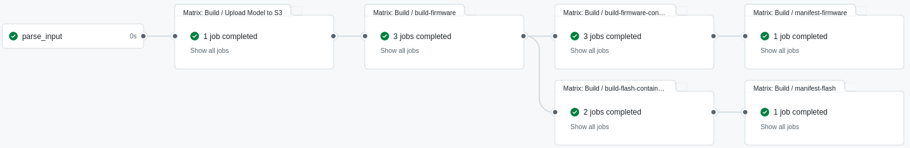

# Application building & packaging

## Introduction

Building and packaging firmware for various esp32 target devices can be a complex and time-consuming endeavor. To address this challenge, we offer the [esp32-build](https://github.com/nubificus/esp32-build) repository, which fully automates the process. This automation is accomplished through GitHub Actions, which trigger building workflows based on a user-provided JSON configuration array. A comprehensive explanation of this process is provided in subsequent sections.


## Workflow Triggering

The user needs to send an input JSON configuration array with the following fields:

1. `"apps"`: This field allows the definition of one or more applications. It is crucial to specify the repository and branch that contain the project, along with the app type and version for each application the user intends to build. Optionally, the user can give paths to a tflite model and a prebuild script and the workflow will ensure to asssemble the model along with the firmware and run the prebuild script before the building. In addition to these, the user can define any variables necessary for their project, and the workflow will convert them into environment variables.

2. `"targets"`: This array includes the target esp32 devices for which the user intends to build their application.

3. `"builder_image"`: This contains a basic container image with esp-idf that can be used for the building process (optional).

4. `"keys"`: This is an array of Github Secrets for signing keys that should be given to esp32-build repository if the user intends to deploy images on devices with security features enabled.

An example of the expected JSON input form is the one below:

```json
{
  "apps":
  [ 
    {
      "repo": "nubificus/fmnist-esp-ota",
      "branch": "main",
      "version":"8.8.8",
      "type": "fmnist-app",
      "model": "models/simple_cnn_tf_frozen.tflite",
      "tensor_allocation_space": "204800",
      "load_model_from_partition": "1",
      "prebuild": "scripts/prepare.sh"
    }
  ],
  "targets": ["esp32s3", "esp32s3r2"],
  "builder_image": "harbor.nbfc.io/nubificus/esp-idf:x86_64-slim",
  "keys": ["ESP32_KEY3"]
}
```


## Building Process

While the building process is quite complex and involves several steps, the most significant ones are as follows:

1. In case the user has provided a model path in the JSON input, the first step ensures that the model is included in the final container image. The model is also uploaded to our S3 storage server.

2. The project repository is fetched and the workflow checks out the specified branch.

3. Any additional app variables provided by the user are defined as environment variables.

4. If any target device has the suffixes `r2` or `r8`, the workflow will set the `quad_psram` or `oct_psram` environment variables, respectively. The user can utilize these variables in their project builder to enable the external PSRAM of their device. 

5. If the user has specified a "prebuild" field that points to a preparation script within the project repository, the workflow will execute it.

6. Using the provided `"builder_image"`, which has the ESP-IDF framework installed, the workflow performs the actual esp32 build for each specified esp32 target device.

7. If the "keys" field is not empty, the workflow will sign the firmware generated in the previous step for each secret key.

8. Similar to the model, the firmware binary artifacts are also included in the container image and uploaded to our S3 storage server.

9. For each target device, a container image containing only the firmware image is constructed for later use by the flash job for OTA updates. However, instead of producing multiple separate container images, the workflow outputs a single manifest that includes all of them, allowing the user to check out their preferred type.

10. Finally, the workflow creates an initial flashing container image that the user can use to physically flash the esp32 device with the previously generated binary artifacts. This container image contains binary artifacts for all device types, and the user can specify the desired type during the `docker run` execution. Additionally, since flashing container images are constructed for both x86 and ARM architectures, the workflow generates a single manifest containing both.



*Figure 1: Example of workflow execution flow illustrating the creation of three firmware building jobs, three firmware container building jobs, and two flashing container building jobs for each of the three device types and two architectures. Additionally, there are two final jobs for assembling the containers into single manifests.*


## Example Run

By creating and executing the following `trigger.sh` script, the user can initiate the workflow and the building process:

```bash
json_input='{ "apps":[ {"repo":"nubificus/fmnist-esp-ota","branch":"main","version":"8.8.8","type":"fmnist-tflite-partition-psram", "model": "models/simple_cnn_tf_frozen.tflite", "tensor_allocation_space":"204800", "load_model_from_partition":"1", "prebuild":"scripts/prebuild.sh" }], "targets":["esp32s3", "esp32s3r2", "esp32s3r8"], "builder_image": "harbor.nbfc.io/nubificus/esp-idf:x86_64-slim", "keys":["ESP32_KEY3"] }'

escaped_json_input=$(echo "$json_input" | jq -Rc .)

TOKEN="<Set your Github Token here>"

curl -X POST \
  -H "Accept: application/vnd.github+json" \
  -H "Authorization: token $TOKEN" \
  -H "X-GitHub-Api-Version: 2022-11-28" \
  https://api.github.com/repos/nubificus/esp32-build/actions/workflows/ci.yml/dispatches \
  -d "{ \"ref\": \"feat_merge_tflite\", \"inputs\": { \"json_input\": $escaped_json_input } }"
```

If the action is successful, it should create the signed firmware binary artifacts for an esp32 device using internal RAM, quad external PSRAM and octal PSRAM. Those binaries, will depend on the existense of a tflite model partition on the flash so that the user can deploy the resnet8 model given. The flashing container manifest should be expected to reside in the path `harbor.nbfc.io/cloud-iot/nubificus/<repo>-flash:<type>-<version>` which in this case is `harbor.nbfc.io/cloud-iot/nubificus/fmnist-esp-ota-flash:fmnist-tflite-partition-psram-8.8.8`. In order to create a new container with that manifest do:

If the action is successful, it will generate signed firmware binary artifacts for esp32s3 devices utilizing internal RAM, quad external PSRAM, and octal external PSRAM, respectively. These binaries will depend on the existence of a tflite model partition in the flash, allowing the user to deploy the provided resnet model. The flashing container manifest is expected to be located at the path `harbor.nbfc.io/cloud-iot/nubificus/<repo>-flash:<type>-<version>` which in this case is `harbor.nbfc.io/cloud-iot/nubificus/fmnist-esp-ota-flash:fmnist-tflite-partition-psram-8.8.8`. To create a new container with that manifest, execute the following command:

```shell
docker run --rm -it --device=<PORT> <IMAGE> \
--port <PORT> --chip <DEVICE_TYPE> --flash_size <FLASH_SIZE> \
[--baud <BAUD>] [--override_pt [normal|normal_with_model|no_factory|no_factory_with_model]]
```

The `--device` argument is a Docker option that grants the container access to the specified hardware port. The other custom arguments used in that command are explained as follows:

* `--port`: Specifies the port through which the firmware will be flashed,
* `--chip`: indicates the device type, which may include the suffixes `r2` and `r8`,
* `--flash_size`: defines the flash size of the device being flashed,
* `[--baud]`: sets the baud rate (frequency) for flashing the board and
* `[--override_pt]`: allows the explicit replacement of the current partition table (generated during the build process) with a new one based on user preferences, expanded across the entire flash of the device. The available options are:
	* `normal`: Creates three app partitions (one factory and two OTA).
	* `normal_with_model`: Creates three app partitions (one factory and two OTA) along with a custom tflite model partition.
	* `no_factory`: Creates two app partitions (two OTA), with the app placed in ota_0.
	* `no_factory_with_model`: Creates two app partitions (two OTA) with the app placed in ota_0, along with a custom tflite model partition.

Assuming we want to flash an esp32s3 with octal external PSRAM on port `/dev/ttyACM4`, with a 16MB flash and three app partitions along with an additional tflite partition, you would run the following command:

```shell
export IMAGE="harbor.nbfc.io/cloud-iot/nubificus/fmnist-esp-ota-flash:fmnist-tflite-partition-psram-8.8.8"
export PORT="/dev/ttyACM4"
docker run --rm -it --device=$PORT $IMAGE --port $PORT --chip esp32s3r8 --flash_size 16MB --override_pt normal_with_model
```